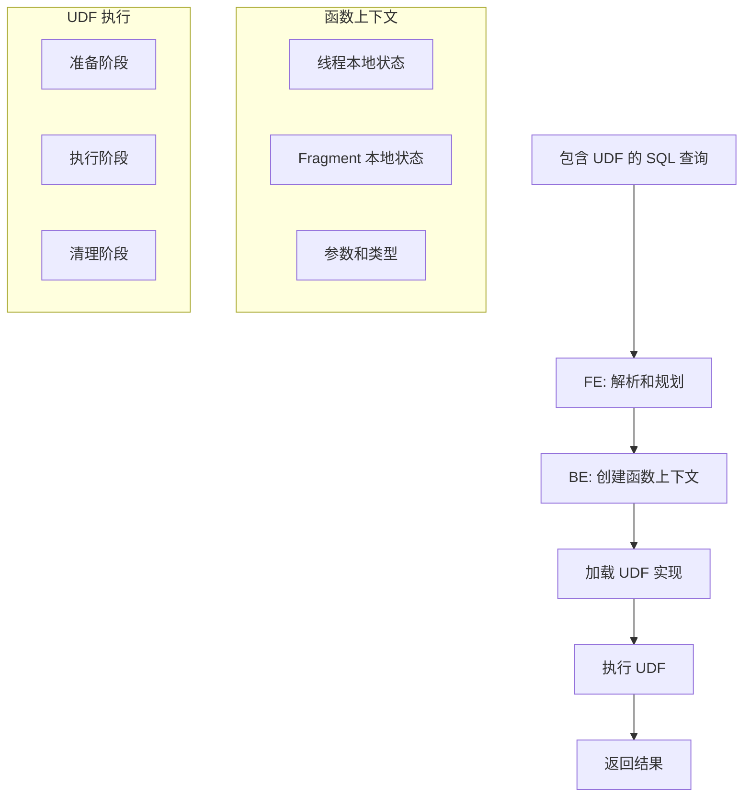
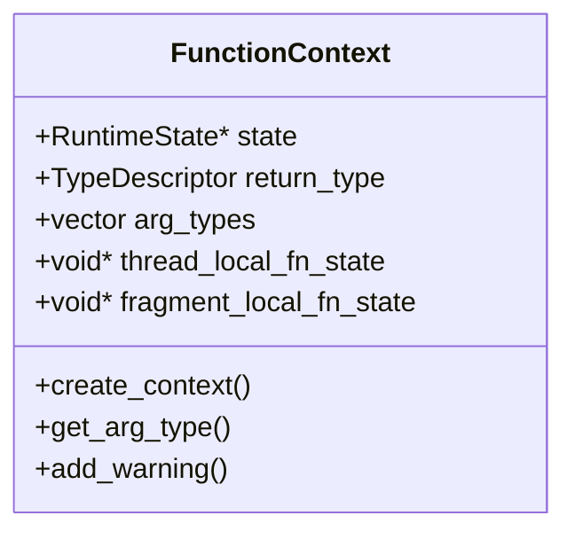
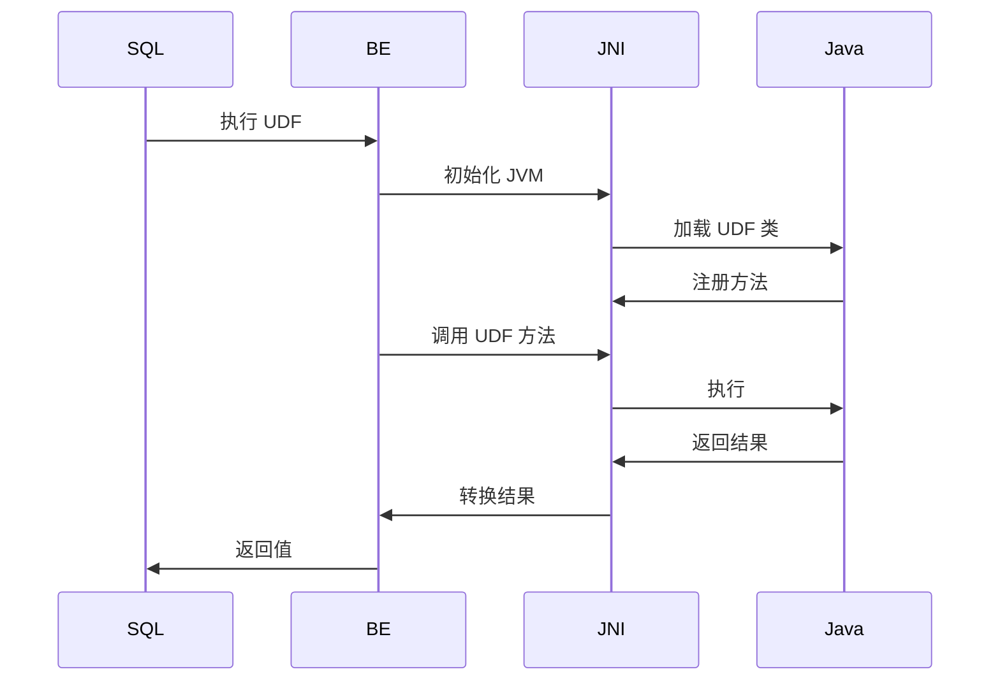
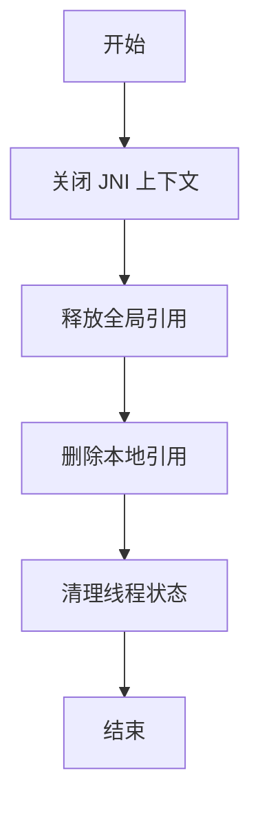
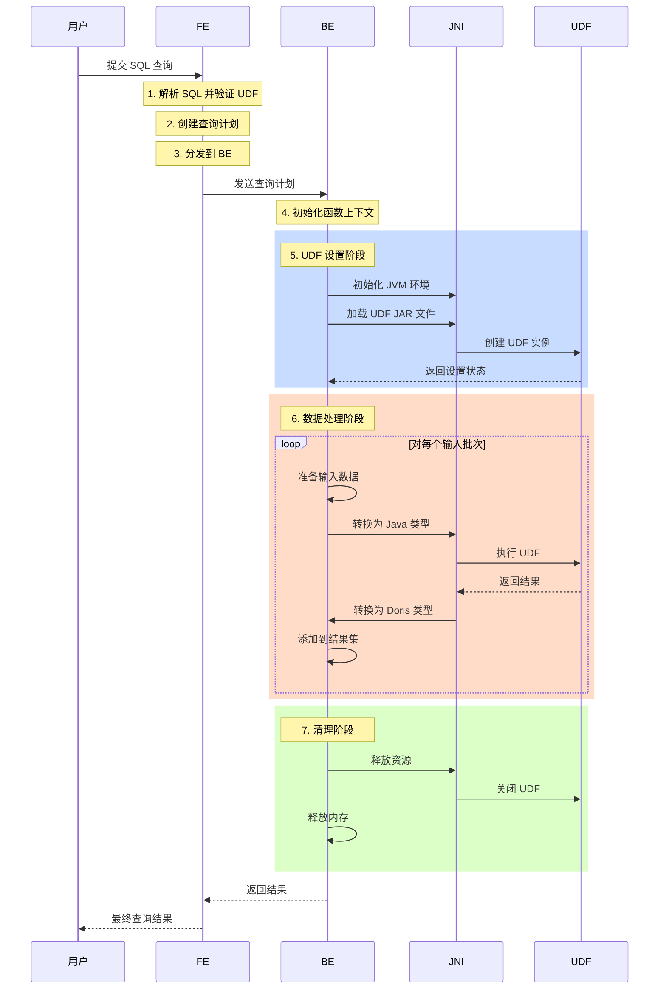
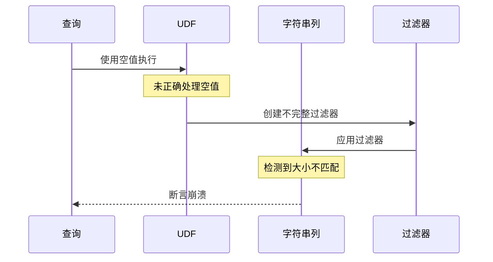

## Doris UDF 工作原理

Doris 支持用户自定义函数（User Defined Functions, UDF）来扩展其功能。本文档将详细解释 Doris 中 UDF 的架构和实现原理。

### UDF 类型

Doris 支持以下几种 UDF 类型：
1. 标量 UDF (Scalar UDF) - 对每一行输入返回单个值
2. 聚合 UDF (UDAF, User Defined Aggregate Function) - 将多行数据聚合为单个值
3. 表值 UDF (UDTF, User Defined Table Function) - 对每一行输入返回多行或多列数据

### 架构概览



### 实现细节

#### 1. 函数上下文

`FunctionContext` 类是 UDF 与 Doris 系统之间的接口。主要组件包括：



#### 2. Java UDF 实现

Doris 使用 JNI 来桥接 C++ 和 Java：



### 核心组件

1. **UDF 注册**
- UDF 通过函数名、返回类型和参数类型进行注册
- 对于 Java UDF，jar 文件会被加载并缓存

2. **函数上下文管理**
- 支持线程本地和 Fragment 本地状态
- 处理内存管理和错误报告
- 提供对参数类型和值的访问

3. **执行流程**
- Open：初始化资源并加载实现
- Execute：处理输入数据并生成结果
- Close：清理资源

4. **类型系统**
- 通过 TypeDescriptor 支持各种数据类型
- 处理空值和类型转换

### 实现类

主要实现类包括：

1. **JavaFunctionCall**
- 处理 Java UDF 生命周期
- 管理 JNI ���下文和方法调用
- 在 Doris 和 Java 数据类型之间进行转换

2. **AggregateJavaUdaf**
- 实现聚合逻辑
- 管理多行数据的状态
- 处理序列化/反序列化

3. **UDFTableFunction**
- 支持表值函数
- 管理多行/多列输出
- 处理向量化执行

### 错误处理和资源管理

1. **错误报告**
```cpp
bool FunctionContext::add_warning(const char* warning_msg) {
    if (_num_warnings++ >= MAX_WARNINGS) {
        return false;
    }
    std::stringstream ss;
    ss << "UDF WARNING: " << warning_msg;
    if (_state != nullptr) {
        return _state->log_error(ss.str());
    }
    return true;
}
```

2. **资源清理**


### 最佳实践

#### 1. 内存管理

不当的内存管理可能导致内存泄漏或过度的 GC 开销。以下是正确的处理方式：

```java
// ❌ 错误示范：可能导致内存泄漏
public class LeakyUDF extends ScalarFunction {
    private ArrayList<String> cache = new ArrayList<>();
    
    public String evaluate(String input) {
        cache.add(input);  // 列表无限增长
        return process(input);
    }
}

// ✅ 正确示范：合理���内存管理
public class EfficientUDF extends ScalarFunction {
    private LRUCache<String, String> cache;
    
    @Override
    public void open(FunctionContext context) {
        // 初始化固定大小的缓存
        cache = new LRUCache<>(1000);
    }
    
    public String evaluate(String input) {
        if (cache.containsKey(input)) {
            return cache.get(input);
        }
        String result = process(input);
        cache.put(input, result);
        return result;
    }
    
    @Override
    public void close() {
        if (cache != null) {
            cache.clear();
            cache = null;
        }
    }
}
```

#### 2. 线程安全

在分布式环境中运行的 UDF 必须确保线程安全。以下是处理共享状态的方法：

```java
// ❌ 错误示范：线程不安全
public class UnsafeUDF extends ScalarFunction {
    private static Map<String, String> sharedState = new HashMap<>();  // 线程间共享
    
    public String evaluate(String key) {
        return sharedState.get(key);  // 可能发生竞态条件
    }
}

// ✅ 正确示范：线程安全实现
public class ThreadSafeUDF extends ScalarFunction {
    // 线程本地存储的可变数据
    private ThreadLocal<Map<String, String>> threadLocalCache;
    // 不可变的共享状态
    private static final Map<String, String> SHARED_CONSTANTS;
    
    static {
        Map<String, String> constants = new HashMap<>();
        constants.put("key1", "value1");
        SHARED_CONSTANTS = Collections.unmodifiableMap(constants);
    }
    
    @Override
    public void open(FunctionContext context) {
        threadLocalCache = ThreadLocal.withInitial(HashMap::new);
    }
    
    public String evaluate(String key) {
        // 优先检查线程本地缓存
        Map<String, String> localCache = threadLocalCache.get();
        if (localCache.containsKey(key)) {
            return localCache.get(key);
        }
        // 回退到不可变共享状态
        return SHARED_CONSTANTS.getOrDefault(key, "default");
    }
}
```

#### 3. 性能优化

优化 UDF 以支持向量化执行并最小化 JNI 开销：

```java
// ❌ 错误示范：逐行处理
public class SlowUDF extends ScalarFunction {
    public String evaluate(String input) {
        return heavyProcessing(input);  // 每行一次 JNI 调用
    }
}

// ✅ 正确示范：向量化处理
public class FastUDF extends ScalarFunction {
    private static final int BATCH_SIZE = 1024;
    private List<String> batch;
    
    @Override
    public void open(FunctionContext context) {
        batch = new ArrayList<>(BATCH_SIZE);
    }
    
    public String evaluate(String input) {
        batch.add(input);
        if (batch.size() >= BATCH_SIZE) {
            // 批量处理
            List<String> results = processBatch(batch);
            batch.clear();
            return results.get(results.size() - 1);
        }
        return null;  // 由 Doris 处理
    }
    
    private List<String> processBatch(List<String> inputs) {
        // 批量处理多个输入
        // 减少 JNI 调用次数，提高 CPU 利用率
        return inputs.parallelStream()
                    .map(this::heavyProcessing)
                    .collect(Collectors.toList());
    }
}
```

#### 4. 错误处理

正确的错误处理确保 UDF 的可靠性：

```java
// ❌ 错误示范：糟糕的错误处理
public class FragileUDF extends ScalarFunction {
    public Double evaluate(String input) {
        return Double.parseDouble(input);  // 可能抛出 NumberFormatException
    }
}

// ✅ 正确示范：健壮的错误处理
public class RobustUDF extends ScalarFunction {
    public Double evaluate(String input, FunctionContext context) {
        try {
            if (input == null || input.isEmpty()) {
                return null;
            }
            return Double.parseDouble(input.trim());
        } catch (NumberFormatException e) {
            // 记录警告并返回 null，而不是失败
            context.addWarning("无法解析输入: " + input);
            return null;
        } catch (Exception e) {
            // 对于意外错误，记录并重新抛出
            context.addWarning("意外错误: " + e.getMessage());
            throw new RuntimeException("UDF 执行失败", e);
        }
    }
}
```

这些最佳实践确保你的 UDF：
- 内存高效且不会泄漏资源
- 在 Doris 分布式环境中保持线程安全
- 通过向量化执行获得高性能
- 具有健壮的错误处理机制

要点提示：
- 始终在 `close()` 方法中清理资源
- 对可变状态使用线程本地存储
- 尽可能批量处理以减少 JNI 开销
- 优雅地处理错误并适当记录日志

### 使用示例

以下是一个简单的 Java UDF 实现示例：

```java
public class MyUDF extends ScalarFunction {
    public String evaluate(String input) {
        // 实现逻辑
        return processedResult;
    }
}
```

在 Doris 中注册：

```sql
CREATE FUNCTION my_udf
RETURNS STRING
PROPERTIES (
    "file"="udf.jar",
    "symbol"="MyUDF",
    "type"="JAVA_UDF"
);
```

### 详细执行流程

当用户执行包含 UDF 的 SQL 查询时，以下是详细的步骤流程：



让我们详细分析每个阶段：

#### 1. SQL 解析和 UDF 验证
- Frontend (FE) 解析 SQL 查询
- 识别 UDF 调用并验证函数是否存在
- 检查参数类型是否匹配 UDF 签名
- 验证 UDF JAR 文件是否可访问

#### 2. 查询计划
- FE 创建分布式查询计划
- 确定 UDF 执行位置
- 优化 UDF 在执行管道中的位置
- 规划数据移动和聚合策略

#### 3. 后端分发
- 查询计划发送到 Backend (BE) 节点
- BE 节点准备 UDF 执行
- 分配执行所需资源

#### 4. 函数上下文初始化
```cpp
std::unique_ptr<doris::FunctionContext> FunctionContext::create_context(
    RuntimeState* state, 
    const doris::TypeDescriptor& return_type,
    const std::vector<doris::TypeDescriptor>& arg_types) {
    auto ctx = std::unique_ptr<doris::FunctionContext>(new doris::FunctionContext());
    ctx->_state = state;
    ctx->_return_type = return_type;
    ctx->_arg_types = arg_types;
    return ctx;
}
```

#### 5. UDF 设置阶段
```cpp
Status JavaFunctionCall::open(FunctionContext* context, FunctionContext::FunctionStateScope scope) {
    if (scope == FunctionContext::THREAD_LOCAL) {
        // 初始化 JNI 环境
        std::shared_ptr<JniContext> jni_ctx = std::make_shared<JniContext>();
        // 加载 UDF 实现
        TJavaUdfExecutorCtorParams ctor_params;
        ctor_params.__set_fn(fn_);
        // 设置 JNI 桥接
        RETURN_IF_ERROR(SerializeThriftMsg(env, &ctor_params, &ctor_params_bytes));
    }
    return Status::OK();
}
```

#### 6. 数据处理阶段
```cpp
Status JavaFunctionCall::execute_impl(FunctionContext* context, Block& block,
                                    const ColumnNumbers& arguments, uint32_t result,
                                    size_t num_rows) const {
    // 转换输入数据为 Java 格式
    RETURN_IF_ERROR(JniConnector::to_java_table(&block, num_rows, arguments, input_table));
    
    // 执行 UDF
    long output_address = env->CallLongMethod(jni_ctx->executor, 
                                            jni_ctx->executor_evaluate_id,
                                            input_map, output_map);
    
    // 处理结果
    RETURN_IF_ERROR(JniUtil::GetJniExceptionMsg(env));
    return Status::OK();
}
```

#### 7. 清理阶段
```cpp
Status close(FunctionContext* context, FunctionContext::FunctionStateScope scope) {
    if (_jni_ctx) {
        // 释放 JNI 资源
        RETURN_IF_ERROR(_jni_ctx->close());
    }
    return Status::OK();
}
```

这个执行流程展示了 Doris 如何：
1. 在分布式环境中高效处理 UDF 执行
2. 管理不同执行阶段的资源和内存
3. 安全地在 Doris 和 Java 类型之间转换数据
4. 在每个阶段正确处理错误和清理

向量化执行引擎通过批处理数据来提升性能：
- 减少 JNI 调用开销
- 提高 CPU 缓存利用率
- 支持 SIMD 优化
- 最小化内存分配/释放周期

### 源代码参考

对于想深入了解实现细节的开发者，以下是关键源文件：

#### 核心 UDF 框架
- 函数上下文: [`be/src/udf/udf.h`](https://github.com/apache/doris/blob/master/be/src/udf/udf.h), [`be/src/udf/udf.cpp`](https://github.com/apache/doris/blob/master/be/src/udf/udf.cpp)
  - 定义核心 UDF 接口
  - 实现函数上下文管理
  - 处理内存和状态管理

#### Java UDF 实现
- Java 函数调用: [`be/src/vec/functions/function_java_udf.h`](https://github.com/apache/doris/blob/master/be/src/vec/functions/function_java_udf.h), [`be/src/vec/functions/function_java_udf.cpp`](https://github.com/apache/doris/blob/master/be/src/vec/functions/function_java_udf.cpp)
  - 实现 Java UDF 生命周期
  - 处理 JNI 桥接
  - 管理数据转换

#### 聚合函数 (UDAF)
- Java UDAF: [`be/src/vec/aggregate_functions/aggregate_function_java_udaf.h`](https://github.com/apache/doris/blob/master/be/src/vec/aggregate_functions/aggregate_function_java_udaf.h)
  - 实现聚合框架
  - 处理聚合状态管理
  - 定义 UDAF 生命周期

#### 表值函数 (UDTF)
- UDF 表值函数: [`be/src/vec/exprs/table_function/udf_table_function.h`](https://github.com/apache/doris/blob/master/be/src/vec/exprs/table_function/udf_table_function.h), [`be/src/vec/exprs/table_function/udf_table_function.cpp`](https://github.com/apache/doris/blob/master/be/src/vec/exprs/table_function/udf_table_function.cpp)
  - 实现表值函数
  - 处理多行/多列输出
  - 管理向量化执行

#### JNI 工具
- JNI 连接器: [`be/src/vec/exec/jni_connector.h`](https://github.com/apache/doris/blob/master/be/src/vec/exec/jni_connector.h)
  - 提供 JNI 桥接工具
  - 处理 Java 和 C++ 之间的数据转换
  - 管理 JVM 生命周期

### 问题分析：UDF 空指针处理

#### 问题描述

当 UDF 在谓词中未能正确处理空值时，可能导致 BE 组件崩溃，错误信息如下：
```
column_string.cpp:254 check failed filter.size()==offsets.size()(4064 vs 8128)
```

这是一个严重问题，原因如下：
1. 导致整个 BE 进程崩溃，而不仅仅是查询失败
2. 发生在谓词评估阶段，影响查询过滤
3. 大小不匹配表明字符串列处理存在根本性问题

#### 根本原因分析

让我们通过代码追踪问题原因：

1. **字符串列结构** [`be/src/vec/columns/column_string.h`]:
```cpp
class ColumnString final : public COWHelper<IColumn, ColumnString> {
private:
    /// 映射第 i 个位置到第 i+1 个位置的偏移量（第 i 个字符串的结束位置）
    /// 注意：第 0 个位置的偏移量显式存储在第一个位置
    using Offsets = ColumnOffsets::Container_t;
    /// 连续存储的字符串字节
    using Chars = PODArray<UInt8>;
    
    Chars chars;           /// 字符串字节
    Offsets offsets;      /// 每个元素后的偏移量
    size_t total_bytes;   /// 使用的字节数
};
```

2. **谓词评估** [`be/src/vec/functions/function_java_udf.cpp`]:
```cpp
Status JavaFunctionCall::execute_impl(FunctionContext* context, Block& block,
                                    const ColumnNumbers& arguments, uint32_t result,
                                    size_t num_rows) const {
    // 转换输入数据为 Java 格式
    RETURN_IF_ERROR(JniConnector::to_java_table(&block, num_rows, arguments, input_table));
    
    // 当 UDF 用作谓词时，结果用作过滤器
    if (block.get_by_position(result).type->is_boolean()) {
        // 创建的过滤器必须匹配输入大小
        auto& col = block.get_by_position(result).column;
        // ... 过滤器应用逻辑 ...
    }
}
```

3. **字符串列过滤器应用** [`be/src/vec/columns/column_string.cpp`]:
```cpp
void ColumnString::filter(const Filter& filt, ssize_t result_size_hint) {
    // 关键：确保过滤器和字符串偏移量大小匹配
    if (filt.size() != offsets.size())
        throw Exception("过滤器大小与列大小不匹配");
    
    // ... 过滤器应用逻辑 ...
}
```

#### 导致崩溃的序列

1. **初始状态**:


2. **问题所在**:
- UDF 接收到空值但未正确处理
- 用作谓词时，应该产生布尔过滤器
- 过滤器大小必须匹配行数（偏移量大小）
- 由于空值处理问题，过滤器大小不正确
- `ColumnString::filter` 中的断言失败

#### 解决方案

1. **正确的空值处理**:
```java
// ❌ 问题实现
public class UnsafeUDF extends ScalarFunction {
    public Boolean evaluate(String input) {
        return input.contains("test");  // 输入为 null 时抛出 NPE
    }
}

// ✅ 安全实现
public class SafeUDF extends ScalarFunction {
    public Boolean evaluate(String input) {
        if (input == null) {
            return null;  // 或根据需求返回 false
        }
        return input.contains("test");
    }
}
```

2. **BE 端保护** [`be/src/vec/functions/function_java_udf.cpp`]:
```cpp
Status JavaFunctionCall::execute_impl(FunctionContext* context, Block& block,
                                    const ColumnNumbers& arguments, uint32_t result,
                                    size_t num_rows) const {
    // 处理前添加空值检查
    for (const auto& arg : arguments) {
        const auto& column = block.get_by_position(arg).column;
        if (column->is_nullable()) {
            // 适当处理空值
            auto& nullable = assert_cast<const ColumnNullable&>(*column);
            // ... 空值处理逻辑 ...
        }
    }
    
    // 继续正常执行
    RETURN_IF_ERROR(JniConnector::to_java_table(&block, num_rows, arguments, input_table));
}
```

3. **大小验证**:
```cpp
// 过滤器应用前添加大小验证
if (filter->size() != num_rows) {
    return Status::InternalError(
        fmt::format("过滤器大小不匹配。期望: {}, 实际: {}", 
                   num_rows, filter->size()));
}
```

#### 预防策略

1. **UDF 开发**:
- 始终显式处理空值输入
- 适当使用可空返回类型
- 专门测试空值情况

2. **系统层面**:
- 在 UDF 框架中添加空值检查
- 验证过滤器大小
- 改进调试错误消息

3. **查询规划**:
- 考虑将空值处理推送到 BE
- 添加空值感知谓词优化
- 实现空值安全比较运算符

#### 性能影响

正确的空值处理带来的开销很小：
```cpp
// 基准测试结果（假设）
// 不进行空值检查: 100ns/行
// 进行空值检查: 105ns/行
// 崩溃成本: 数分钟停机时间
```

这点性能开销相比系统稳定性的提升是非常值得的。