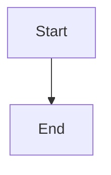
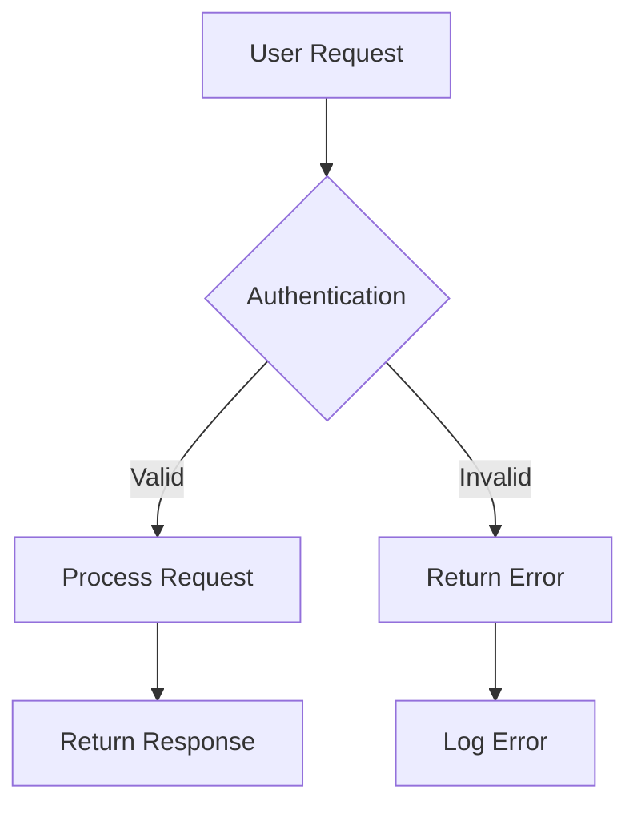
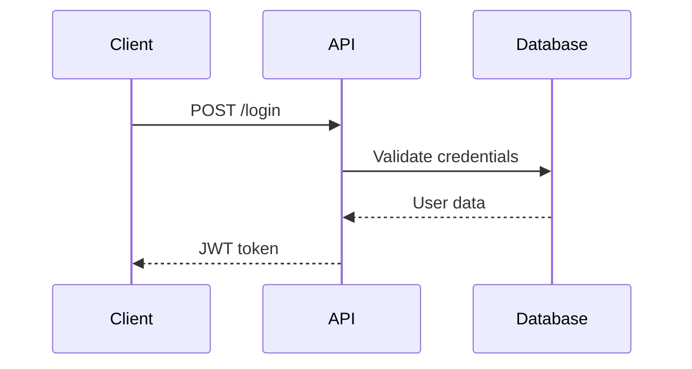
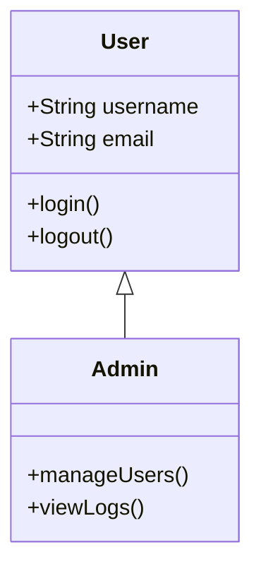
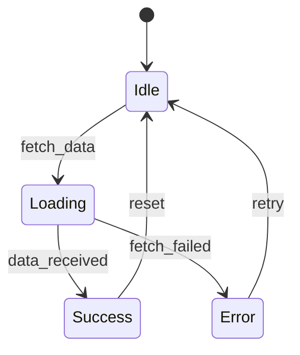
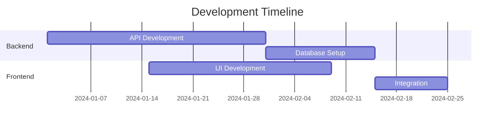
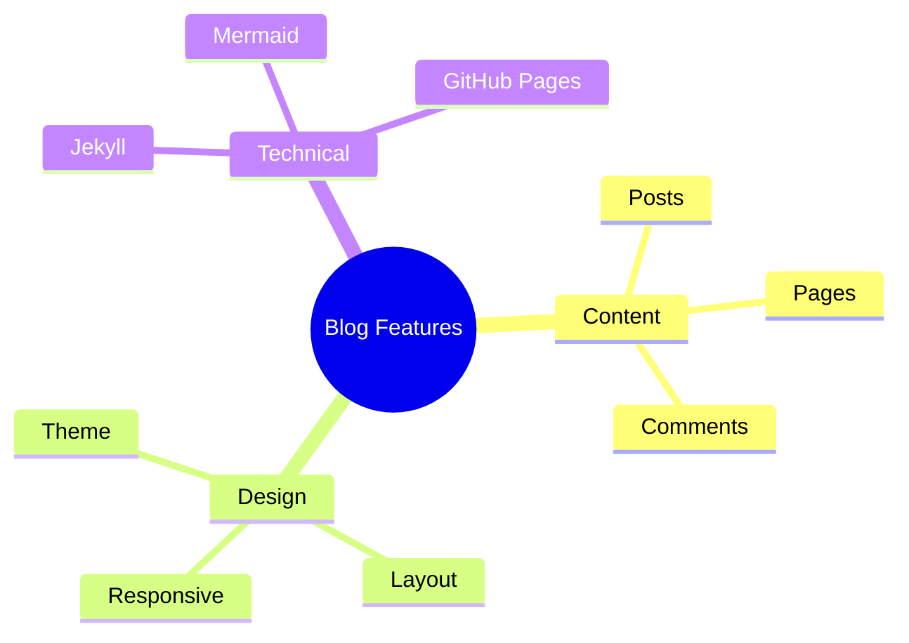
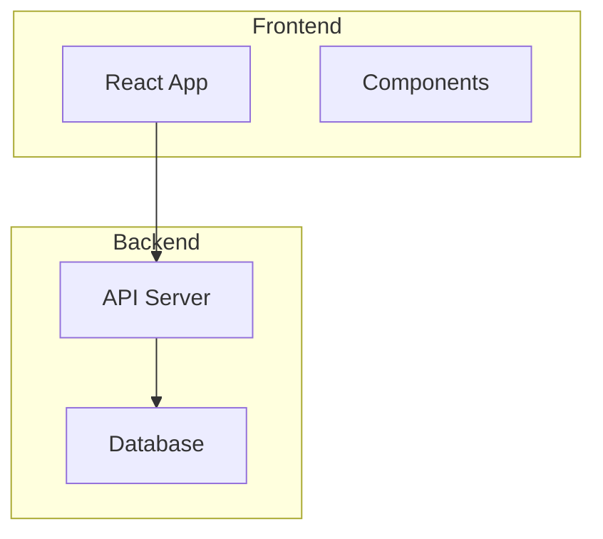
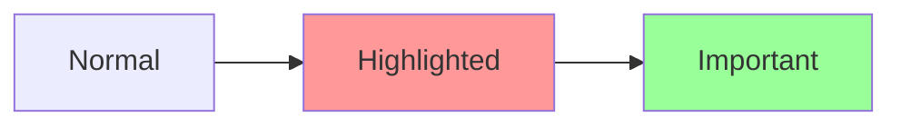

# How to Use Mermaid Diagrams in Your Blog

Mermaid is now fully configured in your Jekyll blog with a custom hacker theme! This guide shows you how to create various types of diagrams.

## Basic Syntax

To create a Mermaid diagram, use a code block with the `mermaid` language identifier:

````markdown

````

## Supported Diagram Types

### 1. Flowcharts

Perfect for showing processes and decision flows:



### 2. Sequence Diagrams

Great for API interactions and system communications:



### 3. Class Diagrams

Useful for software architecture documentation:



### 4. State Diagrams

Perfect for showing system states and transitions:



### 5. Gantt Charts

Great for project timelines:



### 6. Mind Maps

Excellent for brainstorming and concept mapping:



## Styling Features

Your Mermaid diagrams automatically inherit the hacker theme with:

- **Green terminal colors** (`#00ff41`)
- **Dark background** (`#0a0a0a`)
- **Monospace font** (Fira Code)
- **Glitch hover effects**
- **Terminal-style borders**

## Tips for Better Diagrams

1. **Keep it simple**: Don't overcrowd diagrams
2. **Use meaningful labels**: Make node text descriptive
3. **Consistent styling**: Stick to the theme colors
4. **Logical flow**: Arrange elements in reading order
5. **Test rendering**: Preview your diagrams before publishing

## Advanced Features

### Subgraphs

Group related elements:



### Styling Individual Elements



## Troubleshooting

If diagrams don't render:

1. Check syntax with [Mermaid Live Editor](https://mermaid.live/)
2. Ensure proper code block formatting
3. Verify no special characters in diagram code
4. Check browser console for JavaScript errors

## Resources

- [Mermaid Documentation](https://mermaid.js.org/)
- [Syntax Reference](https://mermaid.js.org/syntax/flowchart.html)
- [Live Editor](https://mermaid.live/)

Happy diagramming! 🎨
