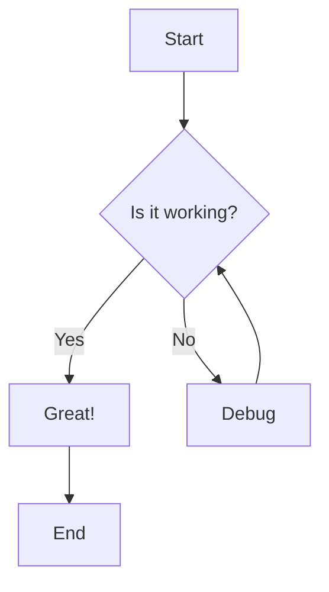
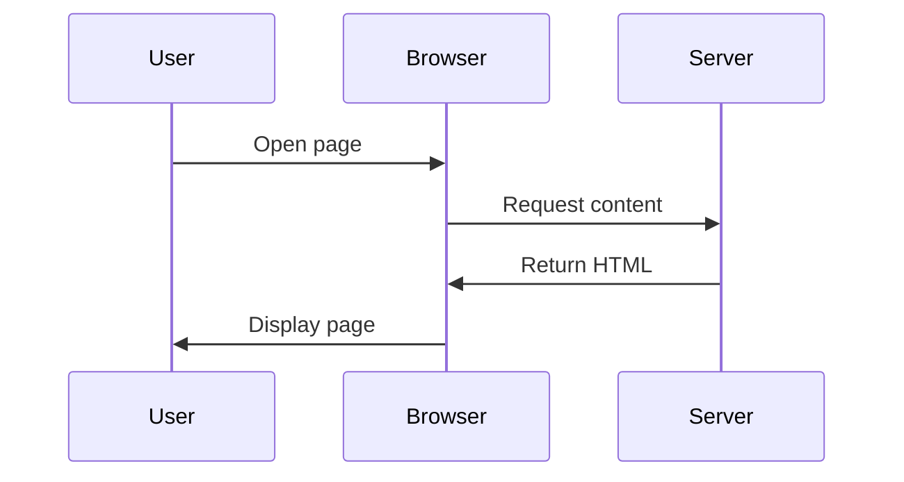
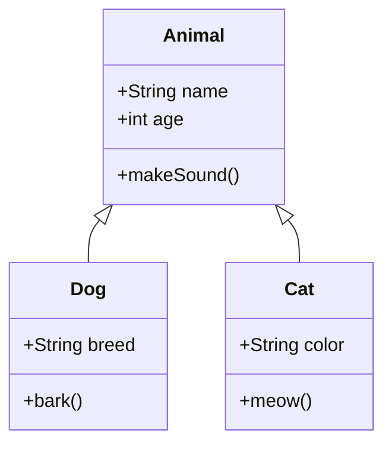
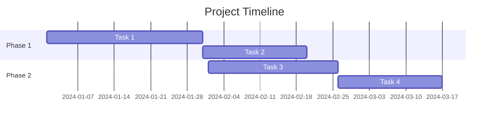
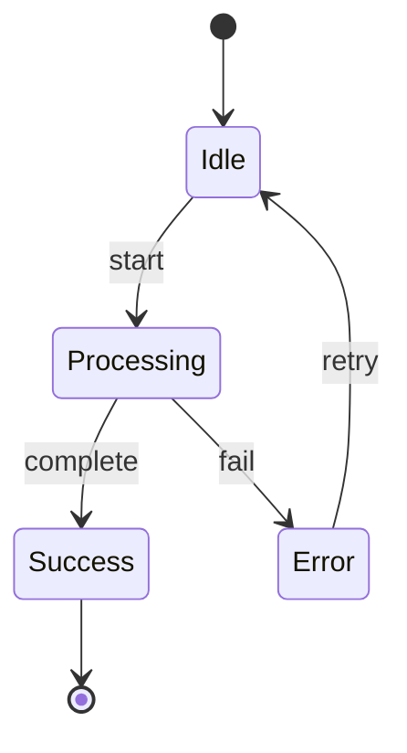
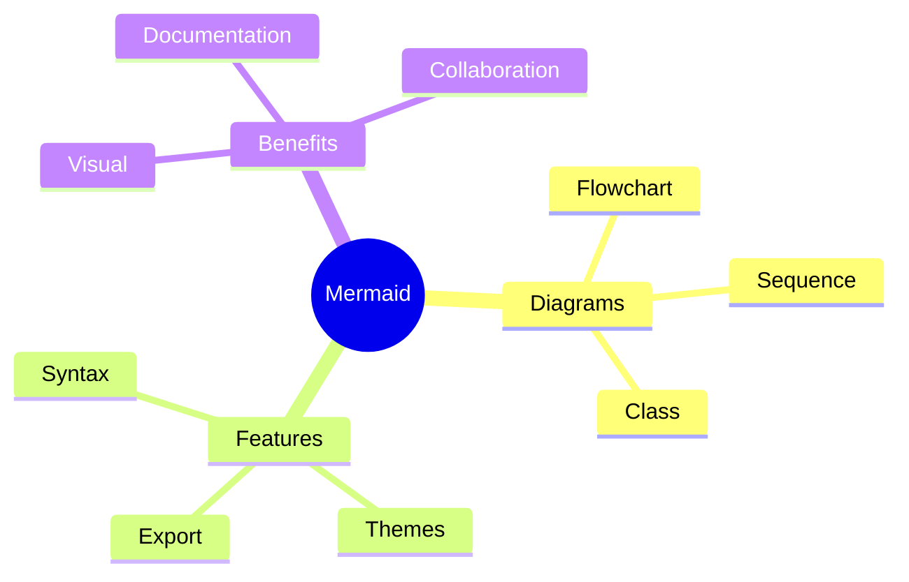

# Mermaid Diagram Test

This page tests various Mermaid diagram types to ensure they render correctly with the hacker theme.

## Flowchart

## Sequence Diagram

## Class Diagram

## Gantt Chart

## State Diagram

## Mind Map

If you can see all the diagrams above rendered correctly with the green hacker theme, then Mermaid is working properly!
